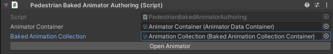

.. _animationBaker

Animation Baker
=====

How To Bake
------------

	#. Open baker in the unity toolbar.
	
		``Spirit604/Animation Baker``
		
	#. Customize texture :ref:`settings <animationBakerSettings>`.
	#. Drag & drop selected `SkinnedMeshRenderer` of pedestrians to `skins` :ref:`field <animationBakedSourceData>`.
	#. Drag & drop selected animations of pedestrians to `clips` :ref:`field <animationBakedSourceData>`.
	
		.. image:: images/pedestrian/baker/window/BakedSourceDataExample.png
		`Drag example.`
		
	#. Press `Create new` button.
	
		.. image:: images/pedestrian/baker/window/BakedSourceDataExample.png
		`Multiple animation result example.`
		
	#. Check the result in the tab :ref:`BakedAnimationData <animationBakedAnimationData>`.
	
		.. image:: images/pedestrian/baker/window/BakedAnimationDataExample.png
		`AnimationData result example.`
		
Baker Window
------------

.. _animationBakerSettings

Settings
~~~~~~~~~~~~

	.. image:: images/pedestrian/baker/window/Settings.png
	
| **Frame rate** :
**Round to size ratio:**
	* **X texture size ratio**
	* **Y texture size ratio**
**Output type:**
	* **Baked animation data**
	* **Texture**
| **Baked animation data** :
	
.. _animationBakedSourceData

Baked Source Data
~~~~~~~~~~~~

	.. image:: images/pedestrian/baker/window/BakedSourceDataExample.png
	.. image:: images/pedestrian/baker/window/BakedSourceDataResult.png
	
| **Skins** :
**Clips:**
	* **Clip** :
	* **Offset** :
	* **Custom animation name** :
| **Texture data** :
	
Buttons
""""""""""""""

| **Create new** :
| **Add to exist texture** :
| **Resize texture** :
| **Save as new** :
| **Save to exist** :
| **Clear** :
	
.. _animationBakedAnimationData
	
Baked Animation Data
~~~~~~~~~~~~

	.. image:: images/pedestrian/baker/window/BakedAnimationDataExample.png
		
| **Sampling skin** :
**Animation data:**
	* **Source mesh** :
	* **Source anim** :
	* **New anim** :
	* **Animation name** :
	* **Frame rate** :
	* **Texture offset** :
	* **Frame count** :
	
How To Replace
""""""""""""""

	#. Drag & drop target character prefab to the scene.
	#. Drag & drop `SkinnedMeshRenderer` of the target character from the scene to `Sampling skin` field.
	#. Drag & drop new animation clip to `New anim` field.
	#. Press `Replace` button.
	
	.. image:: images/pedestrian/baker/window/BakedAnimationDataReplaceExample.png
	`Replace example.`
	
	
Custom Baked Animator
------------

	#. Open on the scene `PedestrianBakedAnimatorAuthoring`.
	
		``Hub/Configs/BakerRefs/Settings/PedestrianBakedAnimatorAuthoring``
		
		

	
	.. image:: images/pedestrian/baker/animator/StartNodeExample.png	
		
.. _animationBakerAnimatorAnimationNode

Animation Node
~~~~~~~~~~~~

	.. image:: images/pedestrian/baker/animator/AnimationNodeExample.png

.. _animationBakerAnimatorTransitionNode

Transition Node
~~~~~~~~~~~~

	.. image:: images/pedestrian/baker/animator/TransitionNodeDefaultExample.png
	.. image:: images/pedestrian/baker/animator/TransitionNodeToGlobalSyncExample.png
	.. image:: images/pedestrian/baker/animator/TransitionNodeToStartExample.png

	.. image:: images/pedestrian/baker/animator/StartSitTransitionExample.png	
	.. image:: images/pedestrian/baker/animator/SitoutTransitionExample.png

.. _animationBakerAnimationCollection

Animation Collection
------------

How To Create
~~~~~~~~~~~~

In the project context menu:
	
	``Spirit604/Animation Baker/Animation Collection``

Settings
~~~~~~~~~~~~
	
	.. image:: images/pedestrian/baker/animator/AnimationCollectionExample.png

.. _animationBakerAnimationSheetData

Baked Animation Sheet Data
------------

.. _animationBakerAnimatorContainer

Animator Container
------------

How To Create
~~~~~~~~~~~~

In the project context menu:
	
	``Spirit604/Animation Baker/Animator Container``
	
Settings
~~~~~~~~~~~~

	.. image:: images/pedestrian/baker/animator/AnimatorContainerExampleSource.png

