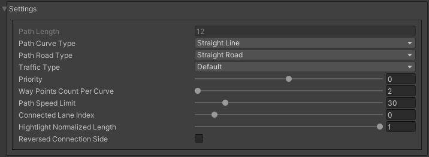

Path
=====

.. _path:

Path
----------------

``Pedestrian node is a node for creating pedestrian routes``

	.. image:: images/road/PathCachedValues.png

	.. image:: images/road/PathVisualSettings.png
	.. image:: images/road/PathSettingsWindow1.png
	
	**Cached values**
	**Source traffic node** :
	**Path connection type:**
		* **Traffic node** :
			* **Connected traffic node** :
		* **Path point** :
			* **Connected path** :
	**Nodes** :
	**Waypoints** :
	**Custom waypoints** :
	**Intersects** :
	

	
	**Settings**
	**Path length**
	**Path curve type:**
		* **Straight line**
		* **Bezier cube**
		* **Bezier quad**
	**Path road type:**
		* **Straight road**
		* **Turn road**
	**Traffic type:**
		* **Default**
		* **Tram**
		* **Traffic public**
	**Priority** :
	**Waypoints count per curve** :
	**Path speed limit** :
	**Connected lane index** :
	**Hightlight normalized length** :
	**Reversed connection side** :
	
	**Visual Settings**
	**Show info on select** :
	**Show info waypoints** :
	**Lock Y axis** :
	**Show intersected points** :
	**Show handles** :
	**Show edit buttons** :
	**Hightlight color** :
	**Show Y position** :
	
	**Buttons:**
		**Open path settings** :
		**Open attach window** :
		**Create path** :
		**Add custom light** :
		**Reset speed limit** :
	
